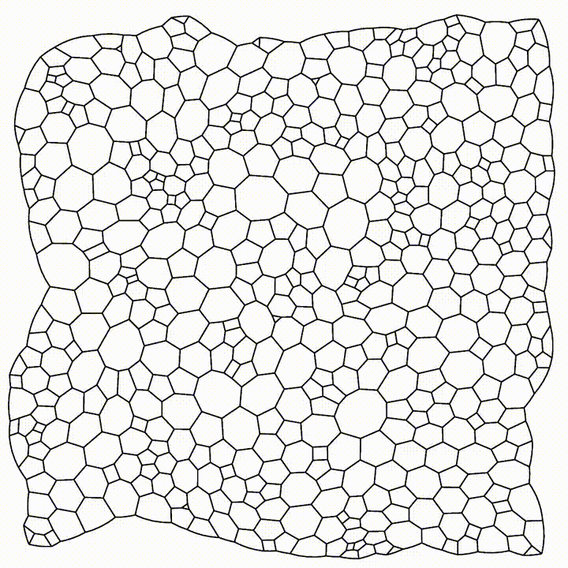

# Numerical simulation of bubbles where pressure difference across whole configuration is zero

## **Project Intro**
This project is for simulating two types of bubble conditions with and without pressure difference. To simulate the bubble condition with uniform pressure, we borrow an active vertex model numberical simulation from biological cell simulation. We also include a simulation with pressure difference a paper for comparison.


### **1. Minimization of energy**
Due to the surface tension in bubble films, bubble tries to contract towards its centre and hence minimizes its total length (or total surface area if we are considering 3D bubble). We can represent the total length of bubble as an energy term, and hence the problem reduces to the minimization of energy. Mathematically, it is to find a collection of bubbles  that fits , where  represent bubble i, and represents the length of that bubble. 

### **2. Without pressure difference**
If pressure difference across bubbles is absent (i.e. whole bubble configuration has uniform pressure), we can assume that area of each bubble remains constant because there is no diffusion of gases across bubbles (The law governing gas diffusion in bubble is ), meaning that the change in bubble area(diffusion of gase) is related to its pressure difference with respect to all its neighbouring bubbles)

Now, we can define a Lagrangian energy term to this condition for us to find a minimized bubble configuration, where. In short, the Lagrangian is a function of a set of bubble configuration. With the constraint that each area (V in the above equation), we are minimizing J(the total length of the bubble configuration). We now want to find a set of bubble congiuration  such that 

The result of this minimized bubble configuration is called Plateau's Law, meaning that in a minimzied configuration, all bubble films are separated from each other by 120 degree, forming a honey-comb hexagonal shape.


(The reason why bee forms hexagonal honey-comb is to save more energy by building a honey-comb with minimized length, subject to a fixed area for each honey-comb cell)
### **3. With pressure difference**

In this condition, our object is still to minimized the total length of bubbles. However, due to gas diffusion, some bubbles will shrink and some bubbles will enlarge. In particular, the law governing the bubble dynamic is called von Neumann's equation of diffusion, . This equation elegantly shows that the change in bubble area is only related to its topological properties; bubble only with hexagonal shape(n=6) will not suffer from a change in shape, and hence is the most stable configuration.

### **4. Active Vertex Model**
Active Vertex Model describes a mathematical model to simulate real cell movements. Particularly, we define an energy term for a cell as 

Basically, the intuitive idea of the above equation is that cell is allowed to move free by inserting an area energy term , and energy is related to the total length of cells and the cohesive force exerted by neighbouring cells 

In addition, we also consider the motion of cell as 


Intuitively, the first term on the left hand side is a frictional force term propotional to the velocity of cell, the first term on the right hand side is a self propulsion term that simulates the ability for cell to move on its own, the second term is the gradient of the (remember that force is the gradient of potential energy), and the last term is the random white Gaussian noise on the position of cell to simulate random thermal energy.

The goal of the Active Vertex Model is thus to find a cell configuration that minimizes , subject to the equation of motion .

reference: https://github.com/sknepneklab/SAMoS
## **Simulation result**

### **1. Bubble simulation with uniform pressure**


As we can see, the resulting configuration is a hexagonal honey-comb shape. There is a slight contraction of the whole configuration because the streched bubbles are returning to their native areas.

The above simulation is made successful by deleting the area term and the cohesion term in , and the white gaussian noise and the self-propulsion term in the equation of motion in Active Vertex Model

### **2. Bubble simulation with pressure difference**


In this simulation, the author of the paper in the below referenced link has used grandient descent method to find a minimized total length of bubble configuration, subject to von Neumann's law of diffusion and Plateau's Law of 120 degree.


reference: https://raw.githubusercontent.com/erleben/FOAM/master/doc/bondorf.17.master_thesis.pdf

## **Running the simulation and input parameters**

I run the simulation on a Ubuntu 20.04.4 LTS WSL machine

Please refer to https://docs.microsoft.com/en-us/windows/wsl/install to install the WSL Ubuntu machine

To run the first simulation with uniform pressure, git clone this repository to your current user's home folder and install the following programmes on your Ubuntu machine:

* Modern C++ compiler supporting the C++11 standard
* Boost libraries (1.48 or newer, in particular Spirit parser)
* GNU Scientific Library (GSL) - version 1.13 or newer\
* CMake (2.8 or newer) - it is recommended to install ccmake GUI
* Doxygen - optional but recommended (LaTeX support for building the PDF reference manual
* VTK library (version 5 or 6)
* CGAL library (version 4.3 or newer). NOTE: Code will fail to compile with CGAL 4.2 or older

You may want to refer to https://github.com/sknepneklab/SAMoS and https://chaste.cs.ox.ac.uk/trac/wiki/InstallGuides/InstallGuide

You will also need to install Paraview on https://www.paraview.org/

Then, cd into with_uniform_pressure and execute 

```bash
~/SAMoS/build/samos cells_fixed.conf
```
You can try to compare this cells_fixed.conf with original.conf in this folder. The original.conf is from https://github.com/sknepneklab/SAMoS

After the execution you should be able to generate the same files as what is inside with_unfirom_pressure_executed.

Open the the folder with_uniform_pressure in Paraview and execute the cell_..vtp and cell_dual_..vtp files for simulation.
